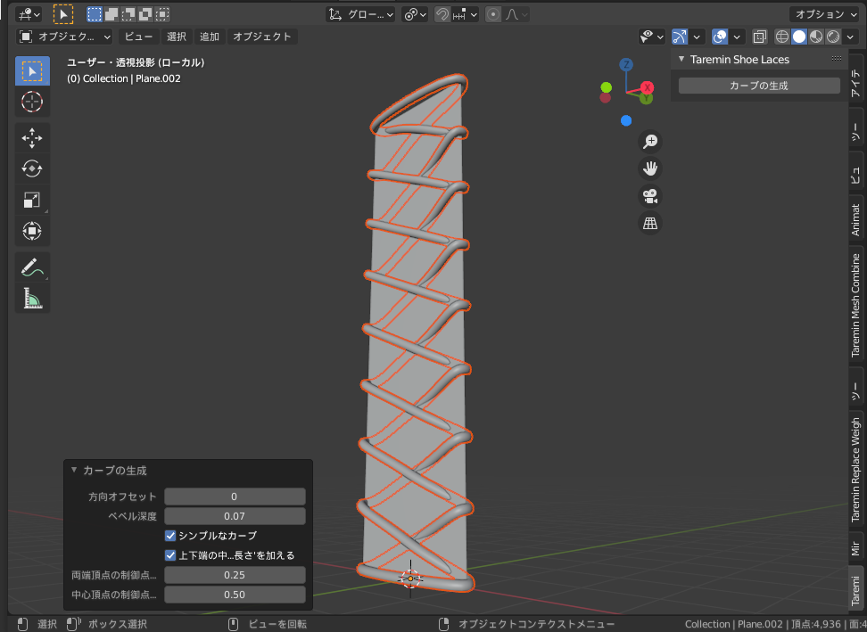

# Taremin Shoelaces

## なにこれ？

ローポリの板メッシュから靴紐のような編み目のカーブを生成します。

## インストール

[Releases](../../releases) から最新の zip をダウンロードして、「ファイル」「ユーザー設定」「アドオン」「ファイルからアドオンをインストール」を選択し、ダウンロードした zip ファイルをインストールします。

## 使い方

1. すべてが四角面で縦x横の形状になっているメッシュを用意します
2. 3Dビューでオブジェクトモードにしてメッシュを選択します
3. UIパネル(デフォルト設定でNキーで開閉)から Taremin タブを開きます
4. Taremin Shoelaces から "カーブの生成" ボタンを押すとカーブを生成します
5. 3Dビューの左下にオペレータプロパティによる設定パネルが出るので、必要な場合は生成したカーブのパラメータを調整します

## 結び目の使い方

`v0.0.5` よりカーブ生成時に結び目をつけることが出来るようになりました。
現在、プリセットとして用意されている結び目は `Shoelace Knot` の一つだけですが、シーン内のカーブオブジェクトを結び目として使うことが出来ます。

### カーブオブジェクトを結び目として使用する

まず、結び目として使用したいカーブオブジェクトをUIパネルの `Knots` に追加します。
結び目として使用するカーブオブジェクトの仕様はは後述します。
`カーブの生成` を行い、オペレータープロパティの `結び目のタイプ` を `オブジェクト` にします。
`knot` で先程追加したオブジェクトを選択します。

その後、カーブのパラメータを調整します。各パラメータの意味は以下のとおりです。
- `左スプラインを逆順にする`
  - 左スプラインの制御点の順番を逆にします(線の方向を逆順にします)
- `右スプラインを逆順にする`
  - 右スプラインの制御点の順番を逆にします(線の方向を逆順にします)
- `左スプラインのindex`
  - カーブオブジェクトの何番目の線を結び目(左)として使用するのか設定します
- `右スプラインのindex`
  - カーブオブジェクトの何番目の線を結び目(右)として使用するのか設定します
- `結び目の前後を反転する`
  - 結び目のY方向の座標を反転して使用します

### 結び目として使用できるカーブオブジェクトの仕様

カーブオブジェクトは以下のような仕様で作成しておいてください。

- 最低でも線が1本以上
  - 実際は2本のカーブを使用するでしょう
- 結び目の中心がオブジェクトの原点になるようにする
- X軸が結び目の左右になるようにします
- Z軸が結び目の上下になるようにします
- カーブオブジェクトにベベル深度を設定してください
  - ベベル深度の差を利用してなんとなく同じくらいになるようにスケールします

例を確認したい場合はアドオンに同梱されている `knots.blend` を参考にしてみてください。

## ライセンス

[MIT](./LICENSE)

## クレジット

- Shoelace Knot: https://www.blendswap.com/blend/26843 
  - Author: [billhails](https://www.blendswap.com/profile/1126269)

## 更新履歴

- 0.0.1: 初期実装
- 0.0.2:
  1. 結び目に近いカーブ構成点を自動で削除する機能の無効化
  2. Booleanモディファイアなどで紐を通す為の穴を開けるためのカーブを追加生成する機能の追加
- 0.0.3:
  1. カドの頂点同士の経路を計算する際にエラーになることがあるバグを修正
- 0.0.4:
  1. 結び方 BowTieShoeLacing の追加
  2. 一部コードの書き方が Blender2.7x のものだったのを修正
- 0.0.5:
  1. 結び目機能の追加
  2. オペレータープロパティUIの変更
  3. ソースコードを複数ファイルに分割
- 0.0.6:
  1. 結び目オブジェクトが0の時に結び目タイプをオブジェクトにするとエラーになるのを修正

